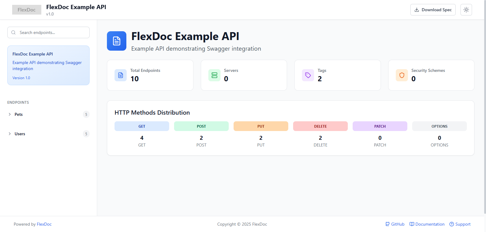
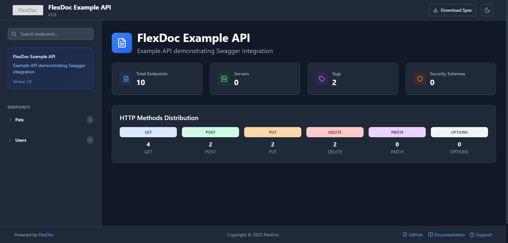

# FlexDoc Backend

[](https://www.npmjs.com/package/@bluejeans/flexdoc-backend)
[](https://opensource.org/licenses/MIT)

The backend package for FlexDoc, a modern, customizable OpenAPI documentation generator that creates beautiful API documentation.

## Screenshots

### Light Mode



### Dark Mode



## Features

- **Modern UI**: Clean, responsive interface with dark mode support
- **Customizable**: Easily customize colors, typography, and layout
- **Interactive**: Test API endpoints directly from the documentation
- **Framework Agnostic**: Works with any JavaScript framework
- **OpenAPI Compatible**: Supports OpenAPI 3.0 specifications

## Installation

```bash
npm install @bluejeans/flexdoc-backend
```

## Usage

### Basic Usage

```typescript
import { FlexDoc } from '@bluejeans/flexdoc-backend';
import { OpenAPIObject } from '@nestjs/swagger';

// Create a new FlexDoc instance with your OpenAPI spec
const flexdoc = new FlexDoc({
  spec: yourOpenAPISpec as OpenAPIObject,
  title: 'My API Documentation',
  description: 'Documentation for my awesome API',
});

// Generate HTML documentation
const html = flexdoc.generateHTML();

// Serve the documentation
app.get('/api/docs', (req, res) => {
  res.send(html);
});
```

### Configuration Options

FlexDoc is highly customizable through the `FlexDocOptions` interface:

```typescript
import { FlexDoc, FlexDocOptions } from '@bluejeans/flexdoc-backend';

const options: FlexDocOptions = {
  // Required
  spec: yourOpenAPISpec,

  // Basic metadata
  title: 'My API Documentation',
  description: 'Documentation for my awesome API',

  // Theme configuration
  themeConfig: {
    colors: {
      primary: {
        main: '#3b82f6',
        light: '#eff6ff',
        dark: '#2563eb',
      },
      // Additional color options...
    },
    typography: {
      fontFamily: 'Inter, system-ui, sans-serif',
      fontSize: '16px',
      // Additional typography options...
    },
  },

  // Footer customization
  footer: {
    copyright: '© 2025 My Company',
    links: [
      {
        text: 'Terms',
        url: '/terms',
        icon: 'file-text', // Optional Lucide icon name
      },
      {
        text: 'Privacy',
        url: '/privacy',
      },
    ],
  },

  // Additional options...
};

const flexdoc = new FlexDoc(options);
```

### Framework Integration Examples

#### NestJS

```typescript
import { NestFactory } from '@nestjs/core';
import { SwaggerModule, DocumentBuilder } from '@nestjs/swagger';
import { FlexDoc } from '@bluejeans/flexdoc-backend';
import { AppModule } from './app.module';

async function bootstrap() {
  const app = await NestFactory.create(AppModule);

  // Create OpenAPI spec with Swagger
  const config = new DocumentBuilder()
    .setTitle('My API')
    .setDescription('My API description')
    .setVersion('1.0')
    .build();
  const document = SwaggerModule.createDocument(app, config);

  // Create FlexDoc instance
  const flexdoc = new FlexDoc({
    spec: document,
    title: 'My API Documentation',
    description: 'Documentation for my awesome API',
    footer: {
      copyright: '© 2025 My Company',
    },
  });

  // Serve FlexDoc at /api/docs
  app.use('/api/docs', (req, res) => {
    res.send(flexdoc.generateHTML());
  });

  await app.listen(3000);
}
bootstrap();
```

#### Express

```typescript
import express from 'express';
import { FlexDoc } from '@bluejeans/flexdoc-backend';
import swaggerJsdoc from 'swagger-jsdoc';

const app = express();

// Generate OpenAPI spec
const options = {
  definition: {
    openapi: '3.0.0',
    info: {
      title: 'My API',
      version: '1.0.0',
    },
  },
  apis: ['./src/routes/*.js'],
};
const openapiSpec = swaggerJsdoc(options);

// Create FlexDoc instance
const flexdoc = new FlexDoc({
  spec: openapiSpec,
  title: 'My API Documentation',
});

// Serve FlexDoc
app.get('/api/docs', (req, res) => {
  res.send(flexdoc.generateHTML());
});

app.listen(3000);
```

## API Reference

### `FlexDoc` Class

The main class for generating API documentation.

#### Constructor

```typescript
constructor(options: FlexDocOptions)
```

#### Methods

- `generateHTML()`: Generates the HTML documentation
- `getOpenAPISpec()`: Returns the processed OpenAPI specification

### `FlexDocOptions` Interface

Configuration options for FlexDoc:

| Property       | Type                            | Description                      |
| -------------- | ------------------------------- | -------------------------------- |
| `spec`         | `OpenAPIObject`                 | The OpenAPI specification object |
| `title`        | `string`                        | Documentation title              |
| `description`  | `string`                        | Documentation description        |
| `themeConfig`  | `ThemeConfig`                   | Theme configuration              |
| `footer`       | `FooterConfig`                  | Footer configuration             |
| `favicon`      | `string`                        | URL to favicon                   |
| `customCss`    | `string`                        | Custom CSS to inject             |
| `customJs`     | `string`                        | Custom JavaScript to inject      |
| `defaultTheme` | `'light' \| 'dark' \| 'system'` | Default theme mode               |

## Contributing

Contributions are welcome! Please feel free to submit a Pull Request.

## License

This project is licensed under the MIT License - see the LICENSE file for details.

